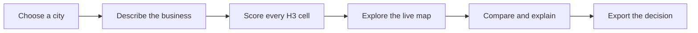

<div align="center">


### Location intelligence for decisions that matter.

Turn city-scale spatial data into a shortlist of places your business can trust.

`React` · `FastAPI` · `MapLibre` · `H3` · `MCDA`

</div>

<br />

> **SiteScope** is a geospatial site-readiness analyzer for comparing business locations across Ahmedabad, Surat, Vadodara, and Rajkot.

## The Product

Most location decisions begin with a map and end with a spreadsheet. SiteScope keeps the whole decision in one place: define what your business needs, see how every urban cell scores, understand why a location wins, and export a report that is ready to share.

### From city to confident shortlist



## What Makes It Useful

| Signal | What SiteScope answers |
| --- | --- |
| Demand | Where are customers and activity concentrated? |
| Accessibility | How easy is the place to reach? |
| Competition | Is the market crowded or underserved? |
| Land suitability | Does the surrounding land use fit the business? |
| Risk | Which constraints could weaken the opportunity? |
| Readiness score | Which locations deserve attention first? |

## Highlights

### Explore

- Real MapLibre basemaps with an H3 score surface.
- Color-coded readiness scores from 0 to 100.
- Live layer controls for population, roads, competitors, land use, and flood risk.
- A top-ranked marker that stays anchored to the current best hexagon.
- Click any hexagon to inspect its score, factors, and nearest readable neighborhood.

### Decide

- Business presets for healthcare, cafe, EV charging, retail, cloud kitchen, and fitness.
- Adjustable weights, decay behavior, competition mode, and constraints.
- Top-location comparison for up to three candidates.
- AI Copilot for natural-language questions and browser voice input.
- Natural place names such as `Navrangpura / CG Road` instead of raw H3 IDs.

### Share

- PDF reports aligned with the dashboard's scores and factors.
- Human-readable place names in selected-site and ranked-location sections.
- CSV export for further analysis.
- SiteScope wordmark and favicon included in the application shell.

## Current Application Flow

The frontend uses one root route and transitions through these views:

1. Landing page with city selection and real India map imagery.
2. Business-needs wizard, with a default path for fast exploration.
3. City and scoring processing state.
4. Analysis dashboard with map, factors, comparisons, Copilot, and exports.

## Technology

### Frontend

- React 19, TypeScript, Vite 8, and TanStack Start/Router
- Zustand with session-storage persistence
- MapLibre GL JS and `h3-js`
- Tailwind CSS, Radix UI, and Lucide icons
- Recharts for analysis visualizations

### Backend

- Python 3.11+, FastAPI, and Uvicorn
- pandas, NumPy, GeoPandas, Shapely, SciPy, scikit-learn, and h3-py
- ReportLab for PDF generation
- Local city boundaries, metadata, and geospatial layers

## Project Shape

```text
src/
  components/
    LandingPage.tsx       Branded landing page and India map hero
    Wizard.tsx             Business-needs questionnaire
    MapView.tsx            Main analysis workspace
    HexMap.tsx             MapLibre H3 visualization
    AiVoiceCopilot.tsx     Natural-language spatial assistant
  lib/sitescope/
    scoring.ts             Client-side scoring fallback
    neighborhoods.ts       City district resolver
    store.ts               Persistent application state
  routes/
    index.tsx              Landing, wizard, processing, dashboard flow
    __root.tsx             Metadata, favicon, and providers
backend/app/
  routers/                 Cities, scores, analysis, AI, and uploads
  services/                Scoring, spatial analysis, routing, and reports
 data/                     City boundaries, metadata, and layers
public/
  sitescope-logo.svg       Full wordmark
  sitescope-mark.svg       Compact mark and favicon
```

## Run It Locally

### Prerequisites

- Node.js 18+
- npm 9+
- Python 3.11+

### 1. Start the backend

From the repository root:

```powershell
python -m venv backend/.venv
backend\.venv\Scripts\Activate.ps1
pip install -r backend/requirements.txt
python -m uvicorn app.main:app --app-dir backend --reload --port 8000
```

API docs: `http://127.0.0.1:8000/docs`

### 2. Start the frontend

In a second terminal:

```bash
npm install
npm run dev
```

Open `http://localhost:8080`. If the port is busy, Vite selects the next available port.

The browser talks to the backend at `http://localhost:8000`. When the backend is unavailable, the client falls back to local scoring data where supported.

## API At A Glance

| Area | Endpoints |
| --- | --- |
| Health | `GET /`, `GET /health` |
| Cities | `GET /cities`, `GET /cities/{id}/meta`, `GET /cities/{id}/hexes` |
| Layers | `GET /cities/{id}/layers`, `GET /cities/{id}/layers/{layer}` |
| Scoring | `POST /score`, `POST /score/point` |
| Spatial analysis | `POST /analysis/hotspots`, `/clusters`, `/underserved`, `/polygon`, `/isochrone` |
| Reports | `POST /analysis/report` |
| AI | `POST /ai/parse-business`, `/explain`, `/compare`, `/sensitivity` |
| Uploads | `POST /layers/upload`, `GET /layers/{city_id}/list` |

## Verify Changes

```bash
npm run build
python scripts/test_report_unit.py
git diff --check
```

Other focused checks live in `scripts/`, including scoring, routing, spatial, boundary, city-data, and AI checks.

## Data Notes

- The supported city datasets and generated caches are stored locally in `data/`, `backend/app/data/`, and `cache/`.
- Map imagery is loaded from ArcGIS raster tiles and requires network access.
- Reports use nearest known districts for readable place names; raw H3 IDs and coordinates are kept out of the primary location labels.
- External AI or routing integrations can be configured through `backend/.env`.

<div align="center">

---

**SiteScope** · Locations today. Brighter tomorrow.

Built for Bit N Build '26 · PS2 B2B Spatial Intelligence

</div>
